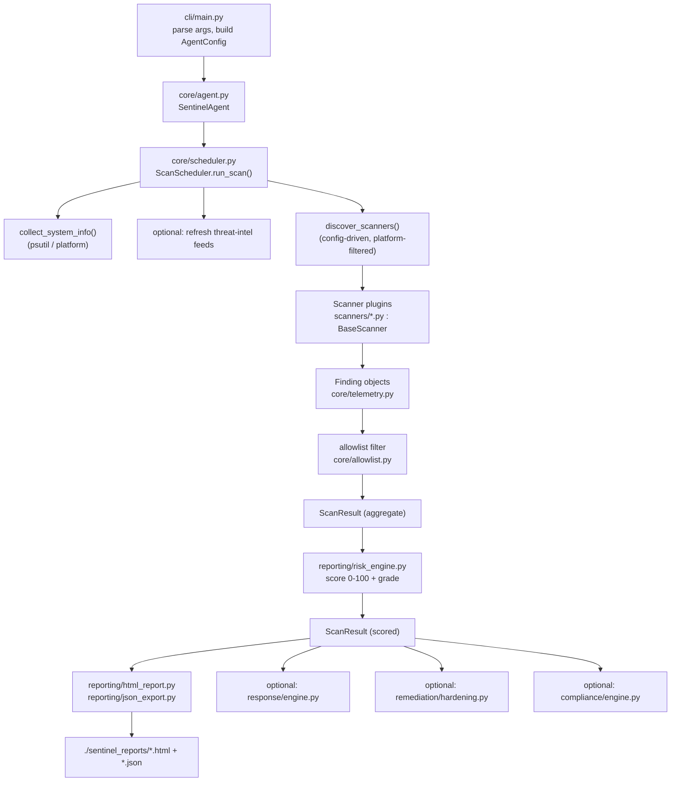

# Architecture

This document describes how the Endpoint Security Agent (internal product name
**Sentinel**) is put together: its entry points, the packages that make up the
codebase, how a scan flows from the CLI down through the scanners and back up
into reports, where state is persisted on disk, and which external services it
talks to.

It is grounded in the actual code as of version `4.0.0`. For the security
posture and threat model, see [`../SECURITY_MODEL.md`](../SECURITY_MODEL.md); for
install/run instructions see [`../SETUP.md`](../SETUP.md) and
[`../README.md`](../README.md).

---

## Overview

Sentinel is a single-host, cross-platform (Windows / macOS / Linux) **defensive**
security agent written in pure Python (3.11+). At its core it is a **scan
pipeline**: a set of pluggable *scanners* inspect the local system, each emitting
`Finding` objects, which are aggregated, risk-scored, and rendered into reports.
Around that core the codebase layers several optional subsystems:

- **Vulnerability intelligence** — correlate installed package versions against a
  local advisory database and the NVD CVE API.
- **Threat intelligence** — pull IOC feeds (IPs, domains, hashes, URLs) into
  local databases and match observed indicators against them.
- **EDR-style realtime monitoring** — a long-running daemon that watches
  processes, connections, DNS, and files, correlates events, and runs a
  ransomware shield.
- **Response & remediation** — opt-in, reversible actions (quarantine, process
  kill, network block, endpoint isolation, hardening) driven by a policy engine.
- **Compliance & reporting** — CIS / NIST / SOC 2 evaluation, HTML/JSON reports,
  SIEM forwarding, and email delivery.
- **Fleet & mesh** — an optional Flask dashboard/API for multi-device management,
  and a peer-to-peer mesh for agent-to-agent threat sharing.

Everything runs locally by default. No data leaves the host unless a feature that
does so (NVD lookup, threat feeds, fleet telemetry, SIEM, email, mesh) is
explicitly enabled and configured.

### Design principles reflected in the code

- **Plugin scanners.** Every scanner subclasses `scanners/base.py:BaseScanner`
  and is discovered/toggled by config. Adding a scanner is additive.
- **Lazy, defensive imports.** Optional subsystems are imported inside functions
  and wrapped in `try/except ImportError`, so the agent degrades gracefully when
  optional dependencies (Flask, watchdog, cryptography, YARA) are absent.
- **Dataclass configuration.** All configuration is plain dataclasses in
  `core/config.py` with safe defaults — read-only, offline, nothing enabled that
  writes to the host.
- **Explicit opt-in for writes.** Scanning is read-only; every mutating action
  (hardening, response, isolation) requires an explicit flag or profile setting,
  and most support `--dry-run`.

---

## Entry Points

| Entry point | File | Purpose |
|---|---|---|
| `sentinel` CLI (`python -m cli.main`) | `cli/main.py` | Primary interface. Parses ~60 flags across scanning, hardening, response, compliance, threat-intel, EDR timeline, allowlist, license, and daemon control. Declared as the `sentinel` console script in `pyproject.toml`. |
| Continuous daemon | `core/daemon.py` | Started by `--daemon`. Runs scheduled scans + file watching + optional real-time guard as background threads. Managed via a PID file. |
| TUI dashboard | `tui/app.py` | Started by `--tui`/`--dashboard`. Interactive Rich-based terminal UI. |
| Fleet web dashboard | `dashboard/app.py` | `python -m dashboard.app`. Optional Flask server exposing a REST API and an HTML fleet view. Requires the `[fleet]` extra. |

All CLI paths converge on **`core/agent.py:SentinelAgent`**, the top-level
orchestrator that exposes `scan()`, `generate_reports()`, `harden()`, and
`respond()`.

---

## Request / Data Flow

### Standard scan (`sentinel --scan --report`)

Step by step (`ScanScheduler.run_scan`):

1. **System info** — `collect_system_info()` gathers hostname, OS, CPU, RAM via
   `psutil`/`platform` into a `SystemInfo`.
2. **Threat-intel refresh** (if `enable_threat_intel`) — `FeedManager` pulls
   fresh IOCs into the local IOC database before scanning.
3. **Scanner discovery** — `discover_scanners()` instantiates only the scanners
   enabled in `config.scan`, then filters to those whose
   `supported_platforms` include the current OS.
4. **Execution** — each scanner's `run()` (base-class wrapper) calls its
   `scan()`, applies the allowlist filter, logs findings, and returns them.
   Exceptions are caught per-scanner so one failure never aborts the run.
5. **Severity filtering** — findings below the profile's `min_severity` are
   dropped.
6. **Risk scoring** — `reporting/risk_engine.py:RiskEngine` computes a weighted
   0–100 score and letter grade from the aggregated findings.
7. **Post-processing** (driven by CLI flags) — reports, response, hardening,
   compliance, and/or kill-chain analysis run against the `ScanResult`.

### Daemon flow (`sentinel --daemon --guard`)

`core/daemon.py:SentinelDaemon` writes a PID file and spawns background threads:

- **Scan scheduler thread** — runs `SentinelAgent.scan()` on an interval derived
  from the active profile (default 1 hour), then optionally responds, generates
  reports, sends notifications for critical/high findings, and purges expired
  quarantine entries.
- **File watcher thread** — `core/file_watcher.py`, polling-based monitoring of
  critical files.
- **File guard thread** (with `--guard`) — `core/file_guard.py`, real-time
  monitoring using `watchdog` when installed (falls back to polling).

The heavier **realtime EDR engine** (`edr/realtime_engine.py`) orchestrates the
process/connection/DNS monitors and the correlation engine on top of the event
store; it is the substrate for the ransomware shield and EDR timeline.

### Fleet flow (`python -m dashboard.app`)

Agents in fleet mode (`fleet/`) register with and submit telemetry to the Flask
server (`dashboard/app.py`), which persists devices and scan history to a SQLite
DB (`dashboard/models.py:DashboardDB`) and serves both a REST API
(`/api/v1/...`) and an HTML dashboard.

---

## Component Breakdown

### `core/` — agent runtime and shared services

| Module | Responsibility |
|---|---|
| `agent.py` | `SentinelAgent` top-level orchestrator (`scan`/`harden`/`respond`/`generate_reports`). |
| `scheduler.py` | `ScanScheduler` — scanner discovery, execution, aggregation, risk scoring. |
| `config.py` | All configuration dataclasses (`AgentConfig` + per-subsystem configs), enums (`Severity`, `ScanDepth`, `AgentEdition`), platform helpers, JSON load/save. |
| `telemetry.py` | Core data models: `Finding`, `SystemInfo`, `ScanResult` (the objects that flow through the whole pipeline). |
| `profiles.py` | Built-in security profiles (`minimal`, `standard`, `strict`, `fort_knox`, `custom`) that expand into scan configs. |
| `daemon.py` | Background monitoring service + PID-file lifecycle. |
| `file_watcher.py` / `file_guard.py` | Polling file watcher and real-time (`watchdog`) file guard. |
| `allowlist.py` | JSON-backed hash/path/process exclusions, optionally scoped per-scanner. |
| `audit_log.py` / `crypto.py` | Tamper-evident HMAC-SHA256 hash-chain audit log with optional AES-256-GCM encryption. |
| `license.py` | Optional open-core license module (HMAC-signed tokens; no functionality is gated in this build). |
| `notifications.py` | Cross-platform desktop notifications. |
| `logging.py` | Structured logging setup and `log_finding` helper. |
| `scheduler.py`, `telemetry.py` | (see above) |

### `scanners/` — the plugin scan layer

All concrete scanners subclass `base.py:BaseScanner` (abstract `name`,
`description`, `supported_platforms`, `scan()`), and the base `run()` wraps each
scan with error handling, logging, and allowlist filtering. ~21 concrete
scanners, grouped roughly as:

- **Posture:** `process_scanner`, `network_scanner`, `startup_scanner`,
  `service_audit_scanner`, `config_scanner`, `package_scanner`,
  `privilege_scanner`, `credential_scanner`, `browser_scanner`,
  `file_integrity_scanner`, `log_analysis_scanner`, `network_vuln_scanner`,
  `device_scanner`, `cloud_scanner`.
- **Threat hunting** (enabled by `--hunt`): `malware_scanner`, `memory_scanner`,
  `persistence_scanner`, `heuristic_scanner`, `ioc_scanner`, `yara_scanner`,
  `amsi_scanner`.
- **Support (not scanners themselves):** `malware_rules.py` (heuristic rule
  definitions) and `rule_manager.py` (custom rule fetch/update).

### `vulnerability/` — CVE correlation

| Module | Responsibility |
|---|---|
| `cve_lookup.py` | Correlates detected software versions to CVEs. |
| `advisory_database.py` | Bundled local database of curated high-impact advisories (works fully offline). |
| `nvd_cache.py` | Rate-limited, file-cached client for the NIST NVD REST API (optional API key raises the limit). |
| `version_analyzer.py` | Version comparison / affected-range logic. |

### `threat_intel/` — indicator feeds and matching

| Module | Responsibility |
|---|---|
| `feed_manager.py` | Discovers feed adapters, rate-limits, and refreshes IOCs. |
| `feeds/` | Feed adapters: `abuse_ch.py` (URLhaus, Feodo, MalwareBazaar), `emergingthreats.py`, `alienvault_otx.py` (needs API key), `base_feed.py`. |
| `ioc_database.py` | JSON-index IOC store (IPs, domains, hashes, URLs) with lookup methods. |
| `hash_database.py` | SQLite store of known-malware file hashes. |
| `matcher.py` | Matches observed indicators against the databases. |
| `models.py` | IOC/threat-category data models. |

### `edr/` — realtime detection and response substrate

Monitors (`process_monitor`, `connection_monitor`, `dns_monitor`,
`etw_monitor`, `sysmon_parser`), a `correlation_engine` for multi-stage attack
detection, `process_tree` tracking, an `event_store` (SQLite) with
`timeline_query`, plus protection features: `ransomware_shield`, `canary_files`,
`backup_snapshots`, `app_control` (application allowlisting), and
`device_control` (USB). `realtime_engine.py` ties the monitors together.

### `response/` — automated, reversible threat response

`engine.py:ThreatResponseEngine` takes a `ScanResult` and, gated by
`policy.py:ResponsePolicy` (profile-driven, supports alert-only mode and
`--dry-run`), dispatches to handlers in `actions/`:
`process_response` (kill), `file_response` (quarantine with encrypted store +
restore), `network_response` (block IP), `endpoint_isolation`, and `kill_chain`
(attack-chain analysis). `playbooks/` provides multi-step response playbooks;
`audit.py` records every action and `rollback.py` reverses them.

### `remediation/` — system hardening & updates

`hardening.py:HardeningEngine` applies safe, vendor-recommended, reversible
hardening derived from findings, delegating to platform modules
(`windows_hardening.py`, `macos_hardening.py`, `linux_hardening.py`).
`firewall_manager.py` manages firewall rules and `updater.py` checks/applies OS
updates. All support dry-run and record before-state for rollback.

### `compliance/` — framework evaluation

`engine.py:ComplianceEngine` maps a `ScanResult` onto CIS, NIST 800-53, and
SOC 2 controls (`models.py`), producing per-control pass/fail/partial results and
a compliance percentage.

### `reporting/` — output and integrations

`risk_engine.py` (scoring), `html_report.py` (Jinja2 template in
`templates/report.html.j2`), `json_export.py`, `siem_integration.py`
(webhook/syslog in CEF/LEEF), and the email stack (`email_sender.py`,
`email_scheduler.py`, `email_config.py`).

### `fleet/` and `dashboard/` — central management (optional)

`fleet/` is the agent-side client (`agent_registration.py`, `policy_client.py`,
`telemetry_client.py`). `dashboard/` is the server side: `app.py` (Flask REST +
HTML), `api.py` (`DashboardAPI` business logic), `models.py` (`DashboardDB`,
SQLite).

### `mesh/` — peer-to-peer threat sharing (optional)

UDP-broadcast peer `discovery.py`, HMAC-signed `protocol.py` with replay
protection, `peer_manager.py`, `transport.py`, and `threat_sharing.py`. Enables
agents on a LAN to share indicators without a central server.

### `os_modules/` — platform abstraction

`base.py` defines the platform capability interface; `loader.py` selects the
correct implementation for the running OS.

### `cli/` and `tui/` — user interfaces

`cli/main.py` (argument parsing + command dispatch), `cli/cleanup_wizard.py`
(interactive fix/skip/allowlist wizard for `--clean`), and the Rich-based TUI
(`tui/app.py`, `panels.py`, `state.py`, `scanner_bridge.py`).

### `packaging/` — distribution

PyInstaller build scripts per OS, a Windows service installer, a macOS launchd
plist, systemd service + timer units, and `auto_updater.py` (opt-in, points at a
user-hosted release server).

---

## Data Stores

All persistent state lives under a per-user, platform-specific Sentinel
directory. There is **no central/production database** for the single-host agent;
stores are created on demand.

| Base location | Windows | macOS | Linux |
|---|---|---|---|
| Data root | `%LOCALAPPDATA%\Sentinel\` | `~/Library/Application Support/Sentinel/` (and `~/Library/Logs/Sentinel/`) | `~/.sentinel/` (logs: `/var/log/sentinel`) |

| Store | Path (relative to data root) | Format | Written by |
|---|---|---|---|
| Scan reports | `./sentinel_reports/` (CWD by default; `--output-dir` to override) | HTML + JSON | `reporting/` |
| Logs | platform log dir (see `core/config.py:_default_log_dir`) | text logs | `core/logging.py` |
| Audit log | `audit/` | JSONL hash-chain (optional AES-GCM) | `core/audit_log.py` |
| Allowlist | `allowlist/allowlist.json` | JSON | `core/allowlist.py` |
| License | `license/` | signed token | `core/license.py` |
| IOC database | `cache/` (IOC JSON indexes) | JSON indexes | `threat_intel/ioc_database.py` |
| Malware hash DB | `hash_db/malware_hashes.db` | SQLite | `threat_intel/hash_database.py` |
| NVD cache | `cache/nvd/` | JSON (24h TTL) | `vulnerability/nvd_cache.py` |
| EDR events | `edr/events.db` | SQLite | `edr/event_store.py` |
| Quarantine | quarantine dir | encrypted file store + metadata | `response/actions/file_response.py` |
| Snapshots / canaries | `snapshots/`, canary dirs | files | `edr/backup_snapshots.py`, `edr/canary_files.py` |
| App-control whitelist | `appcontrol/whitelist.json` | JSON | `edr/app_control.py` |
| Device history | `devices/history.json` | JSON | `edr/device_control.py` |
| Daemon PID | `sentinel.pid` (or `/var/run/sentinel.pid` as root) | text | `core/daemon.py` |
| Fleet dashboard DB | operator-chosen (`--db`) | SQLite | `dashboard/models.py` |

---

## External Services & APIs

Every network integration is optional and off by default. The agent is fully
functional offline.

| Service | Endpoint(s) | Used by | Auth |
|---|---|---|---|
| NIST NVD | `https://services.nvd.nist.gov/rest/json/cves/2.0` | `vulnerability/nvd_cache.py` | Keyless (rate-limited); optional API key raises the limit. Sends only product name/version. |
| abuse.ch URLhaus | `https://urlhaus.abuse.ch/downloads/text_recent/` | `threat_intel/feeds/abuse_ch.py` | None |
| abuse.ch Feodo Tracker | `https://feodotracker.abuse.ch/downloads/ipblocklist_recommended.txt`, `.../malware_hashes.csv` | `threat_intel/feeds/abuse_ch.py` | None |
| abuse.ch MalwareBazaar | `https://bazaar.abuse.ch/export/txt/sha256/recent/`, `.../csv/recent/` | `threat_intel/feeds/abuse_ch.py` | None |
| Emerging Threats | `https://rules.emergingthreats.net/blockrules/compromised-ips.txt` | `threat_intel/feeds/emergingthreats.py` | None |
| AlienVault OTX | `https://otx.alienvault.com/api/v1/pulses/subscribed` | `threat_intel/feeds/alienvault_otx.py` | API key required (configured in agent config, not env) |
| SMTP (email reports) | operator's SMTP server | `reporting/email_sender.py` | Operator-supplied credentials (agent config) |
| SIEM / webhook | operator's webhook or syslog host | `reporting/siem_integration.py` | Operator-configured |
| Fleet server | operator's dashboard URL | `fleet/*.py` → `dashboard/app.py` | Enrollment token / API key (agent config) |
| Auto-update server | `ENDPOINT_AGENT_UPDATE_URL` (no default) | `packaging/auto_updater.py` | Operator-hosted; no-op if unset |

### Runtime dependencies

Required (always installed): `psutil`, `requests`, `rich`, `jinja2`.
Optional extras (`pyproject.toml`): `flask` + `flask-cors` (`[fleet]`),
`watchdog` (`[daemon]`), `cryptography` (`[encryption]`), `pyinstaller`
(`[packaging]`). Optional subsystems are guarded by `try/except ImportError`, so
the agent runs even when an extra is missing.

---

## Configuration & Secrets

- **Configuration** is expressed as dataclasses in `core/config.py`, all with
  safe (read-only, offline) defaults. `AgentConfig.load()/save()` serialize to
  JSON. Runtime overrides come from security **profiles** and CLI flags.
- **Environment variables** — the agent reads only two:
  `ENDPOINT_AGENT_LICENSE_KEY` (optional HMAC signing key; falls back to a public,
  non-secret development default, since nothing is gated in the open-source build)
  and `ENDPOINT_AGENT_UPDATE_URL` (auto-updater base URL; no default → no-op).
  See [`../.env.example`](../.env.example).
- **All other credentials** (NVD/OTX keys, SMTP, feed keys, fleet enrollment) are
  supplied through the agent's own config or CLI flags, **not** environment
  variables, and are never hardcoded.

---

## Extending the Agent

- **New scanner:** subclass `scanners/base.py:BaseScanner`, implement `name`,
  `description`, `supported_platforms`, and `scan()`; add an `enable_*` flag in
  `core/config.py:ScanConfig` and register it in
  `core/scheduler.py:discover_scanners()`.
- **New threat feed:** implement a `threat_intel/feeds/base_feed.py:BaseFeed`
  adapter and register it in `feed_manager.py:_discover_feeds()`.
- **New response action:** add a handler under `response/actions/` and wire it
  into `response/engine.py` behind the policy checks.

---

## Connections

- [`../README.md`](../README.md) — features, install, usage, configuration table.
- [`../SETUP.md`](../SETUP.md) — platform setup, packaging, full CLI reference.
- [`../SECURITY_MODEL.md`](../SECURITY_MODEL.md) — threat model and out-of-scope
  capabilities.
